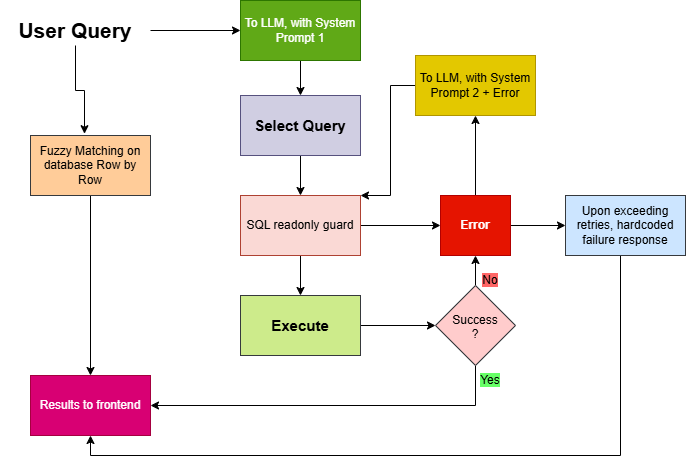

# HireAssist

**Repository:** [github.com/varshil009/HireAssist](https://github.com/varshil009/HireAssist)

Mini hiring pipeline web app: Kanban stages, immutable audit history, **fuzzy name hints** while typing, and **natural-language search** via a guarded **Gemini → SQL** prompt chain.

| | |
|---|---|
| **Stack** | FastAPI · SQLite · React · Tailwind · Google Gemini |
| **Docs** | [project_structure.md](project_structure.md) · workflow below |
| **Data** | Prebuilt [`data/hireassist.db`](data/hireassist.db) — no seed required for eval |

---

## Workflow

<p align="center">
  
</p>

<p align="center"><em>Recruiter actions, search paths, and pipeline rules (see <a href="project_structure.md">project_structure.md</a>).</em></p>

---

## Prerequisites

> **Important:** Use Python **3.9–3.13** inside `backend/.venv` (**3.9–3.12** recommended on Windows).  
> If your default `python` is **3.14**, run **`py -3.9 setup.py`** — otherwise `pydantic` may try to compile from source and fail without Visual Studio Build Tools.

- **Node.js 18+** (for the frontend)
- **Google Gemini API key** — set `GEMINI_API` in `backend/.env` (required for **AI search** and live eval)

---

## Quick start

All commands from the **repo root** (folder containing `setup.py`, `run.py`, `backend/`, `frontend/`).

### 1 · One-time setup

```powershell
git clone https://github.com/varshil009/HireAssist.git
cd HireAssist

py -3.9 setup.py          # strongly recommended if `python` is 3.14
# or: python setup.py     # when default Python is 3.9–3.13
```

`setup.py` creates `backend/.venv`, installs Python + npm packages, and copies `backend/.env.example` → `backend/.env` if missing.

### 2 · Configure Gemini

Edit **`backend/.env`** and set:

```env
GEMINI_API=your_key_here
```

Optional: `GEMINI_MODEL`, `GEMINI_RPM=15`, `GEMINI_MAX_RETRIES=3` (see [backend/.env.example](backend/.env.example)).

### 3 · Run the app

```powershell
backend\.venv\Scripts\activate    # Windows (repo root)
python run.py
```

macOS/Linux: `source backend/.venv/bin/activate` then `python run.py`.

| URL | Service |
|-----|---------|
| **http://localhost:5173** | React UI (use this) |
| http://127.0.0.1:8000 | FastAPI |
| http://127.0.0.1:8000/health | Health check |

Press **Ctrl+C** in the terminal to stop **both** backend and frontend.

<details>
<summary>Manual two-terminal start (optional)</summary>

- Terminal 1 (venv activated): `python main.py`
- Terminal 2: `cd frontend` → `npm run dev`

</details>

---

## Eval (optional)

With **`backend/.venv` activated** at repo root:

```powershell
python eval\run_eval.py --offline   # reference SQL only, no API key
python eval\run_eval.py             # live NL→SQL (needs GEMINI_API)
```

**Pass criterion:** **exact set match** of candidate IDs vs `eval/queries.json` (plus optional `expected_message_substring`).  
**Reported score:** query **accuracy** = passed / total. Set precision/recall/F1 are logged for analysis only.

---

## Architecture (short)

- **SQLite** — `positions`, `candidates` (stages, sticky `offered_flag` / `hired_flag`), append-only **`stage_events`**, resume **BLOBs**
- **FastAPI** — pipeline CRUD, resume upload/download, fuzzy suggest, AI search
- **Search UX** — fuzzy while typing; **Search** / Enter → **two-attempt** Gemini SQL (SELECT-only guard); fixed message after 2nd failure
- **React + Tailwind** — Kanban + search results table

Full module map: [project_structure.md](project_structure.md).

---

## Decisions and trade-offs

| Decision | Rationale |
| -------- | --------- |
| **Both fuzzy and AI search** | Name-style lookups should not need an LLM; NL questions use **Search** + Gemini. |
| **LLM for NL search** | Queries can combine stage, position, and dates — keyword routing is brittle. |
| **SQLite3** | No separate DB server; fits assignment scope. |
| **Resumes as BLOBs** | Keeps storage in one file with candidates. |
| **RPM limit + exponential retries** | Avoids Gemini 429/500 bursts during eval and demos. |
| **Five DB tables** (+ `sqlite_sequence`) | Candidates + flags/timestamps; `stage_events` audit; `resumes` blobs; `positions` openings. |
| **Eval with NL + expected ID sets** | Checks generated SQL **and** grounded result rows. |

### Where we disagreed with AI

| What AI suggested | What we shipped |
| ----------------- | --------------- |
| Open a static resume file on disk | **GET** resume **BLOB** from DB → PDF in browser (`{Name}_RESUME.pdf`) |
| Keyword filters (`"interview"`, `"hiring"`, …) | **LLM → SQL** for multi-condition questions |
| Fuzzy match on **full name** only | Match **first** and **last** name separately (e.g. `pri` → Priya) |

---

## With more time

- Agentic, multi-hop Q&A over resumes (compare YoE, salary, education)
- Larger LLM eval sets
- Clickable filters on search result tables
- Auth and multi-tenant recruiters
